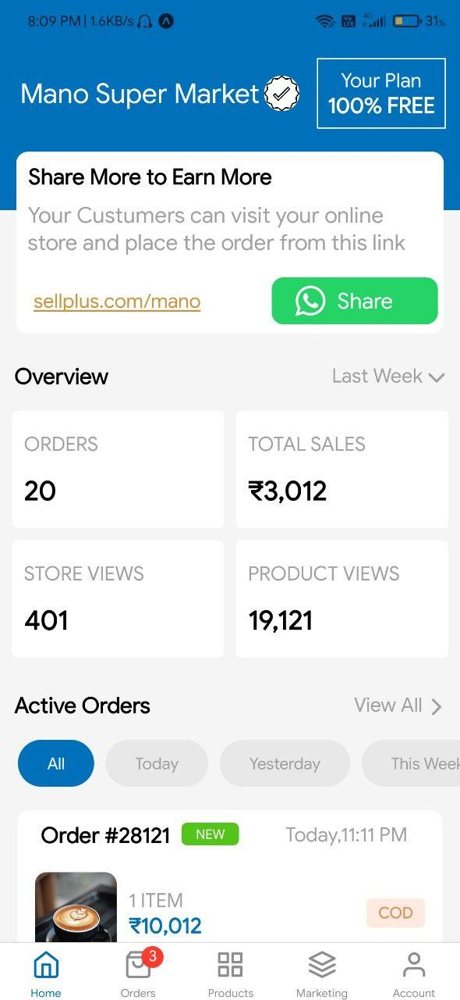
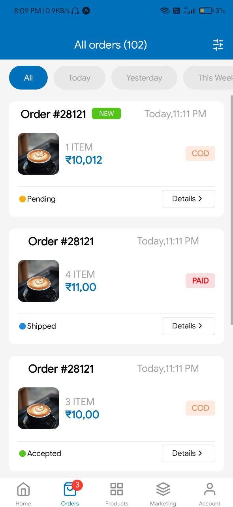
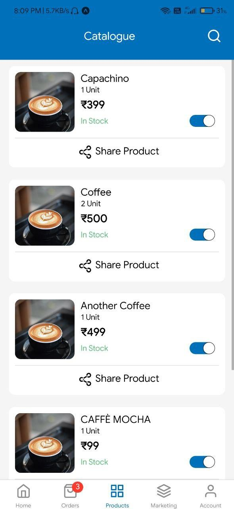
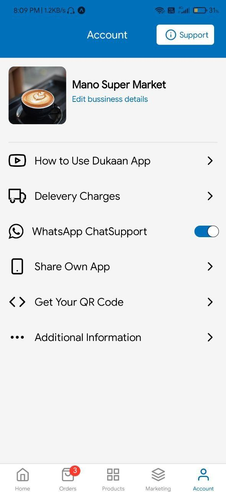

# Dukaan App Clone in React-Native

## Features

- Only UI Implementation

## Preview 📸

|                                                                 |                                                                  |
| --------------------------------------------------------------- | ---------------------------------------------------------------- |
|  |  |

|                                                                     |                                                                    |
| ------------------------------------------------------------------- | ------------------------------------------------------------------ |
|  |  |

## Tools :wrench:

-

## How to Run 🚀

- Clone the repo `git clone https://github.com/hrithik73/dukaan-app-clone.git`
- Install the dependicies `npm install or yarn install`
- Run it `npm start or expo start`
- Scan the QR code in expo client app on your phone
